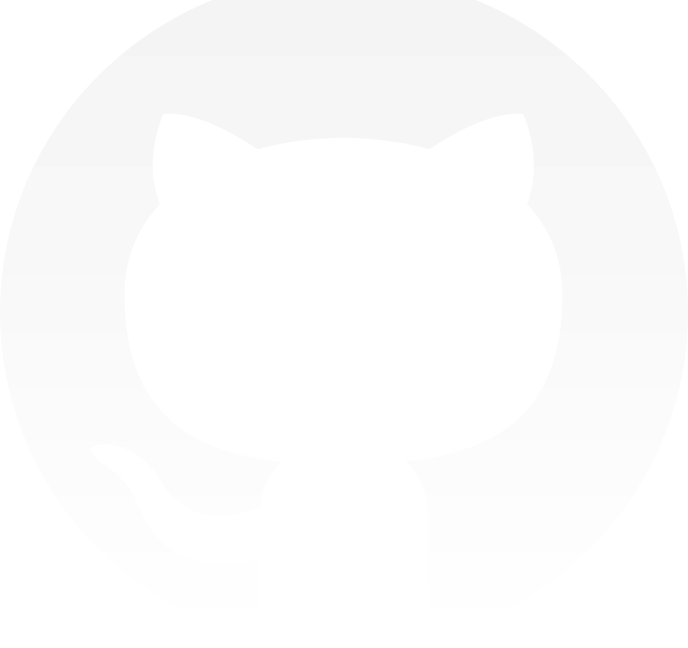

<p align="center">
  <a href="" rel="noopener">
 </a>
</p>

<h3 align="center">github-explorer</h3>

<div align="center">

[]()
[]()
[](/LICENSE)

</div>

---

<p align="center"> Few lines describing your project.
    <br>
</p>

## 📝 Table of Contents

- [About](#about)
- [Getting Started](#getting_started)
- [Usage](#usage)
- [Built Using](#built_using)
- [Authors](#authors)

## 🧐 About <a name = "about"></a>

This project is a result of one module of bootcamp GoStack, by Rocketseat. Allows the user to search repositories on the public API of Github and see how many stars, forks and issues the project have.

<a href="https://githubexplorernunes.netlify.app/" ></a>

## 🏁 Getting Started <a name = "getting_started"></a>

These instructions will get you a copy of the project up and running on your local machine for development and testing purposes. See [deployment](#deployment) for notes on how to deploy the project on a live system.

### Prerequisites

What things you need to install the software and how to install them.

```
yarn@1.22.4^

node@13.13.0^
```

### Installing

After you clone the repository in your machine and all the requirements are set.
You should run

```
yarn install
```

And then

```
yarn start
```

The project will start on htttp://localhost:3000/.
Make sure this port :3000 is available to run the project.

## 🎈 Usage <a name="usage"></a>

On the input of home page you should enter the user/repo to make a search.

## ⛏️ Built Using <a name = "built_using"></a>

- [ReactJs](https://reactjs.org/) - A JavaScript library for building user interfaces.
- [Styled Components](https://styled-components.com/) - Visual primitives for the component age.
- [TypeScript](https://expressjs.com/) - a language for application-scale JavaScript development.

## ✍️ Authors <a name = "authors"></a>

- [@rocketseat](https://github.com/rocketseat) - Idea & Initial work
